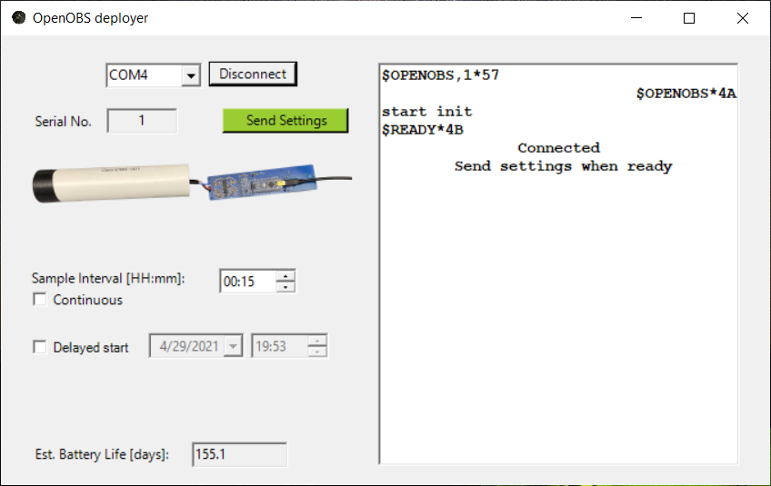
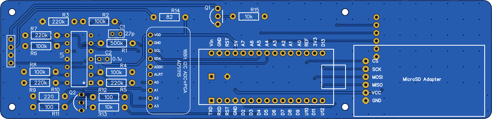
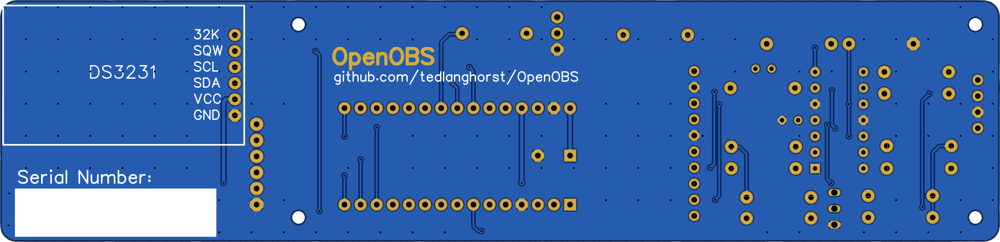

# OpenOBS
Optical backscatter sensors are instruments commonly used in scientific research and water quality management to determine the turbidity (cloudiness) of water, or how much particulate matter is in the water. OpenOBS is an academic research project to develop an open source, affordable, and accurate OBS using an Arduino microcontroller and off-the-shelf electronics. While commercial sensors cost upwards of \$1000, OpenOBS can be built for about \$50. This low-cost alternative allows us to more extensively monitor natural systems, or use in high-risk environments, where deployment of a large number of commercial sensors would be cost-prohibitive.

read the preprint! https://eartharxiv.org/repository/view/2453/

  

## Turbidity logger

### Sensing
The most novel element of OpenOBS schematic is the analog sensing circuit, which emits near-infrared (NIR) light and produces a voltage proportional to the light scattered back by the turbid water. The peak sensitivities of the emitter and receiver diodes are between 870-900 nm. A daylight filter on the receiving diode blocks most visible light. Ambient near-infrared light can still influence the signal, however unless the sensor is deployed very near the surface, the water will absorb incoming NIR radiation. We use an unbiased, high gain transimpedance amplifier to convert the microampere scale response of the photodiode to the 0-5 voltage range that is measured by the analog-to-digital converter. 

The off-the-shelf turbidity sensors used in many DIY electronics projects unfortunately do not work well for accurately measuring wide ranges of turbidity. These sensors use a phototransistor which behave more like a switch, with a logarithmic-like relationship with the amount of incident light. Photodiodes, on the other hand, produce a highly linear current response to incident light over several orders of magnitude. Further, the off-the-shelf sensors measure transmissivity (how much light passes through the sample) rather than backscatter (how much light is scattered back towards the sensor) of the water. 

  

*Simplified emitter and receiver schematic for the OpenOBS.*

### Logging
We use an Arduino Nano microcontroller to program and coordinate the data logging half of the OpenOBS. The voltage output of the analog circuit is read directly by an ADS1115 module, a 4-channel 16-bit analog-to-digital converter and communicated to the Arduino via I2C.  A microSD card module handles the voltage level conversion and writes the sensor data over an SPI interface. A DS3231 real time clock module maintains the date and time with an accuracy of +/- 2 minutes per year and temperature within 3˚C. The clock module also has an alarm function that we use to switch the battery connection on and off. Disconnecting the battery instead of using the various low-current sleep modes of the processor and auxiliary modules results in extremely low current consumption between measurements.  Using 2 AA alkaline batteries in series and a boost converter set to 5 Volt output, the battery current consumption is 90 milliamps during measurement and 10 microamps between measurements.  

## Deployment GUI
An OpenOBS can be deployed using the default settings by simply inserting a microSD card and batteries. If the clock module was not kept running by a battery, the time will default to midnight January 1st, 1970. If you wish to update the time, change the logging interval, or delay the start time, the deployment GUI can communicate those settings to an OpenOBS through the mini USB connector on the Arduino Nano. The OpenOBS and GUI exchange simple ascii messages with [XOR parity bytes](https://en.wikipedia.org/wiki/Checksum#Parity_byte_or_parity_word) over the serial port to safely communicate the settings and monitor the sensor startup. The VB.NET source code and project files are included, however an executable (.exe) file is located in the [deploy GUI's binary folder](/OpenOBS_deployGUI/bin). You will need a windows computer with a compatible version of the .NET framework and the entire contents of the binary folder to run the program- do not only download the .exe file. **Please test that the program will run on your computer before trying to deploy a sensor.**

  

*After connecting to an available COM port, the deployer will listen for an available OpenOBS and then echo that message to let the OpenOBS know that you are connected. If the clock, ADC, or SD card fail to initialize, a warning message will appear and you will not be able to proceed. If the OBS successfully initializes, the "send settings" button will be enabled and the OBS will wait for a "set" command. After receiving the settings, some sample data will be displayed to verify the OBS is working. *

## Hardware

### Printed Circuit Board
An OpenOBS can be built using only off-the-shelf electronic submodules and carefully wired together into a sensor, however the result is often messy and prone to errors (the prototyping phase of the project confirms this). The custom printed circuit board (PCB) simplifies the process by both routing the signals between subcomponents, and providing a structural backbone that easily slides in and out of the housing.

  

  

### 3D Printed Endcap

  

*Rendered endcap (left) showing the internal lip to fit a 1.5" PVC pipe, and printed endcap (right) showing the external face with emitter and receiver diodes in epoxy.*
